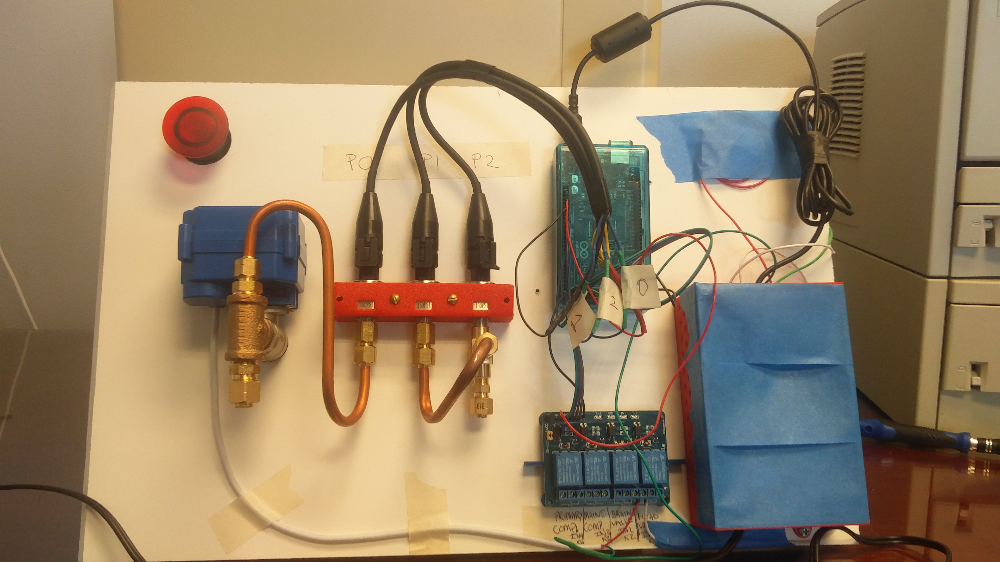

# airCompressorController
This helps maintain a steady head pressure and manage air compressors from prematurely burning out their motors.
It also drains the water from the compressors as routine maintenance. Displays state through an LCD. Specifications for logic were given
in terms of a statemachine then were implemented as a switch case where every case is considered a different state. All done in one file
to make flashing arduino easier when switching between the online editor and Arduino IDE that is local.

# WIP Pic (Don't have other photos)

